<a href="https://tech.omni-solutions.co">
  <picture>
    <source media="(prefers-color-scheme: dark)" srcset="./assets/banner-dark.svg">
    
  </picture>
</a>

 

**[Website](https://tech.omni-solutions.co)** · **[Services](https://tech.omni-solutions.co/#services)** · **[How we work](https://tech.omni-solutions.co/#process)** · **[Contact](https://tech.omni-solutions.co/#contact)**

 

We started by building networks, maintaining computers and installing video surveillance for homes and small businesses. Today we also develop custom software (web, desktop and mobile applications) for clients in Bulgaria and abroad.

Software and infrastructure under one roof, no subcontractors, and support after the handover.

## What we do

### `01` Software solutions
Web, desktop and mobile applications, websites and automation.

| Service | What you get | From |
| :-- | :-- | --: |
| [**Web, desktop and mobile applications**](https://tech.omni-solutions.co/services/web-applications) | Custom software for browser, desktop and phone, with integrations and business process automation | Quote |
| [**Websites and online stores**](https://tech.omni-solutions.co/services/web-design) | Presentation websites and online stores with payments, fast and optimised for search engines | €450 |

### `02` IT infrastructure
Networks, computers and video surveillance, installed and configured on site.

| Service | What you get | From |
| :-- | :-- | --: |
| [**Networks and Wi-Fi coverage**](https://tech.omni-solutions.co/services/local-networks) | Wired and wireless networks with a stable connection in every room | €25 |
| [**Windows and PC support**](https://tech.omni-solutions.co/services/operating-systems) | Installation, repair, upgrades and optimisation for desktops and laptops | €20 |
| [**Video surveillance and IP cameras**](https://tech.omni-solutions.co/services/video-surveillance) | Design, installation and setup of cameras with secure remote access | €20 |

### `03` Support and security
Monthly care for the systems already running at your place.

| Service | What you get | From |
| :-- | :-- | --: |
| [**Maintenance plan**](https://tech.omni-solutions.co/services/maintenance-support) | Monthly checks, updates and remote help for the systems we installed | €10 / month |
| [**Network security audit**](https://tech.omni-solutions.co/services/network-security-audit) | A review of the network, router and cameras with a clear report on what to fix | €150 |

Starting prices for the smallest standard job. Every project gets a written quote first.

## How we work

<picture>
  <source media="(prefers-color-scheme: dark)" srcset="./assets/process-dark.svg">
  
</picture>

## Who we work with

|   |   |
| :-- | :-- |
| **Small businesses and offices** | A network, computers and a website that just work |
| **Online shops** | A fast store with payments that ranks well in search |
| **Homes and premises** | Wi-Fi in every room and cameras you can check from your phone |
| **Clients abroad** | Custom software, built and maintained remotely |

## Open source

| Repository | About |
| :-- | :-- |
| [**omni-tech-solutions-web**](https://github.com/omni-tech-solutions/omni-tech-solutions-web) | Our website: Next.js 15, React 19, TypeScript and Tailwind CSS, in Bulgarian, English and Turkish |

 

**Have a project in mind?**

We reply to every enquiry within 24 hours, in Bulgarian, English or Turkish.

✓ Reply within 24 h &nbsp;·&nbsp; ✓ No subcontractors &nbsp;·&nbsp; ✓ Written quote &nbsp;·&nbsp; ✓ Support after handover &nbsp;·&nbsp; ✓ Bulgaria and abroad

